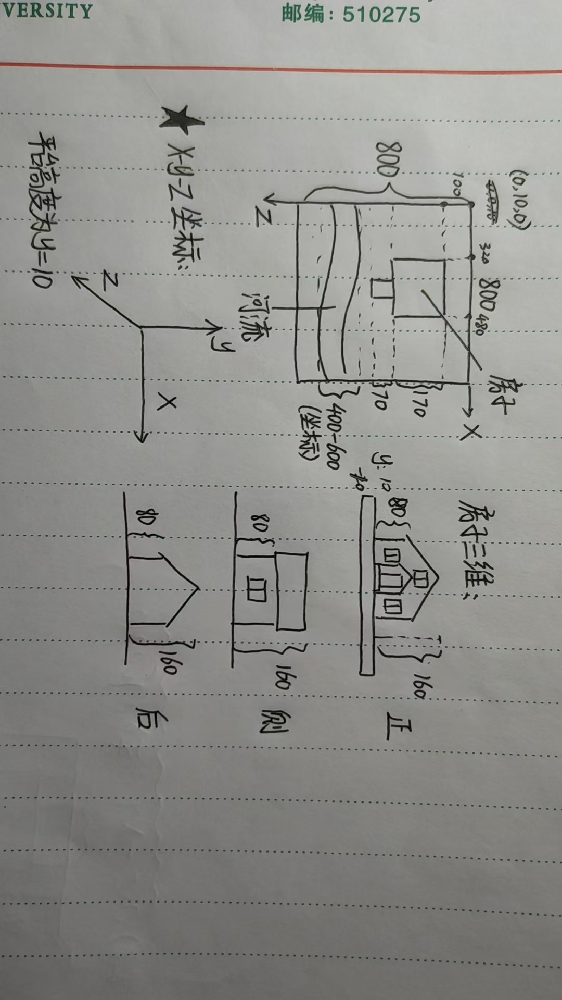

# opengl-final-project
opengl期末大作业  
opengl版本： 4.6.0 - Build 32.0.101.6790（兼容问题暂时未测试）  
配置：下载freeglut  
基础场景构成说明：  
    
注意事项：  
1.house.cpp中创建玻璃的代码在display()最后实现，要不创建完玻璃时候再创建的物体无法透过玻璃看到。    
2.目前玻璃材质采用的是glColor4f(WHITE,0.2)，透光效果未知，后续进行光照系统实验时可能有问题,代码中我会准备备选材质，如果还是有问题可以问一下大模型。  
3.其它功能可以新开代码模块来实现，再整合到已有的代码中（如场景部件实现后可在display()中通过坐标进行搭建，光照系统可测试后在main.cpp中进行初始化等操作），也可根据实际需求对已有代码进行更改。  
4.特别注意：基础场景中xyz坐标不太一样，y轴向上，x轴向右，z轴向前（详情键基础场景说明）
